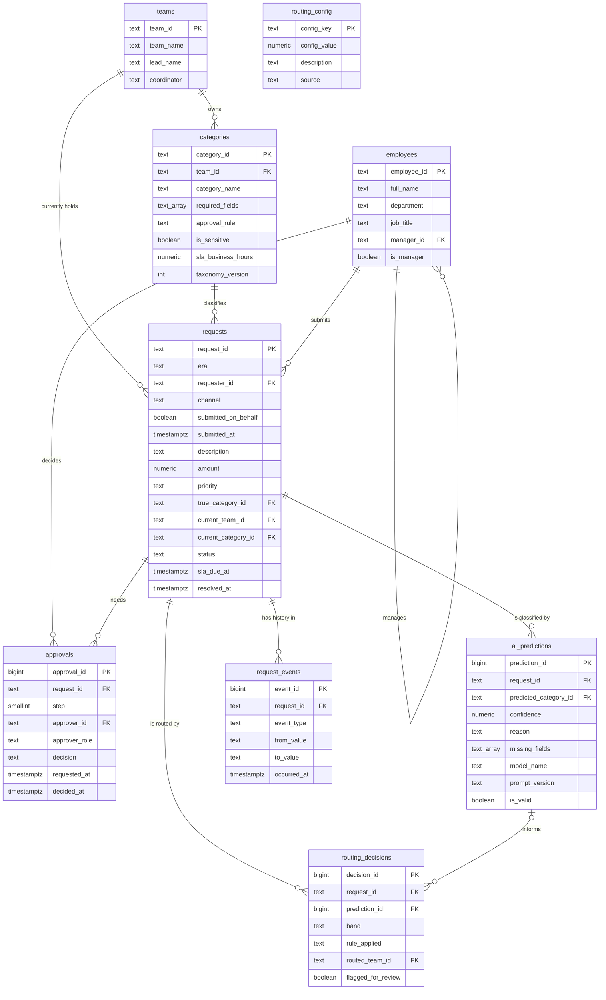

# Breezio Service Hub: Data Model

**Version:** 1.0
**Date:** 2026-09-22
**Author:** Magaly Gonzalez
**Phase:** Slice 1, Phase 3 (Data model)
**Related documents:** `requirements.md`, `../sql/01_schema.sql`, `../sql/02_reference_data.sql`

---

## 1. Purpose

This document describes the Postgres database behind the Service Hub: what each
table holds, how the tables connect, and which requirement each design choice
serves. The SQL that builds it is in the `sql/` folder.

## 2. Design principles

| Principle | What it means here | Requirement |
|---|---|---|
| Rules are data | Categories, SLAs, thresholds, and approval rules live in tables. Changing a threshold is an update, not a code change | NFR-10, FR-60 |
| Facts are logged, never edited | Every change to a request is a new row in `request_events`. A trigger blocks updates and deletes | NFR-04 |
| AI and rules are stored separately | What the AI suggested (`ai_predictions`) is kept apart from what the rules decided (`routing_decisions`), so the two can be compared | BO-06, FR-13, FR-20 |
| One place per KPI | KPIs are calculated from these tables by SQL views in Phase 5, never in the dashboard code | NFR-03 |
| Locked by default | Row level security is on for every table, with no public policies | NFR-09 |

## 3. Entity relationship diagram

`routing_config` stands alone on purpose. The rules layer reads it by key.

## 4. Tables

### 4.1 Reference tables

| Table | Holds | Rows | Loaded by |
|---|---|---|---|
| `teams` | The four service teams, with lead and coordinator | 4 | `02_reference_data.sql` |
| `categories` | Taxonomy v1.0: required fields, approval rule, sensitive flag, SLA in business hours | 19 | `02_reference_data.sql` |
| `routing_config` | Thresholds and timings: 0.90, 0.70, $2,500, stale and auto-close days | 7 | `02_reference_data.sql` |
| `employees` | 300 fictional employees with departments and managers | 300 | Synthetic generator (Phase 3, step 2) |

### 4.2 Core tables

| Table | One row per | Feeds |
|---|---|---|
| `requests` | Request. Holds its current state | Every dashboard view |
| `ai_predictions` | AI classification attempt | K9, K10, FR-13, FR-14 |
| `routing_decisions` | Routing decision, with the band and the rule that won | K1, K10, BR-01 to BR-04 |
| `approvals` | Approval step (1 manager, 2 Finance) | K6, FR-30 to FR-32 |
| `request_events` | Anything that happened to a request | K1 to K8, the audit trail |

### 4.3 Where each KPI comes from

| KPI | Calculated from |
|---|---|
| K1 Time to assignment | `request_events`: created to first routed |
| K2 Resolution time | `requests`: submitted_at to resolved_at, in business hours |
| K3 SLA attainment | `requests`: resolved_at compared to sla_due_at |
| K4 Misroute rate | `request_events`: requests with at least one rerouted event |
| K5 Missing-information rate | `request_events`: requests with an info_requested event |
| K6 Approval cycle time | `approvals`: requested_at to decided_at |
| K7 Status inquiry rate | `request_events`: status_inquiry events per request |
| K8 Stale open requests | `request_events`: open requests with no status_changed event in 3+ business days |
| K9 Classification quality | `ai_predictions` compared to labels (Slice 2) |
| K10 Confidence band mix | `routing_decisions`: count by band |
| K11 Triage effort | Modeled from event counts and the MA and MF assumptions |

Business-hour arithmetic (8:00 to 17:00, Monday to Friday) is added as a SQL
function in Phase 5, so every KPI uses the same clock.

## 5. Design decisions

| # | Decision | Why |
|---|---|---|
| DM-01 | Text IDs that people can read (`BRZ-2026-00042`, `CAT-IT-01`, `EMP-0042`) instead of number-only keys | Matches the IDs in the documents, and a coordinator can say one out loud. A check constraint enforces the request ID format (FR-01) |
| DM-02 | An `era` column marks each request as `current_state` or `future_state` | The same database holds a modeled baseline year and a future-state year, so the dashboard can compare them side by side (FR-58) |
| DM-03 | `true_category_id` stores the category the synthetic generator intended | **Synthetic data only.** It lets Slice 1 test routing logic end to end. It is not an accuracy measure. Real accuracy comes from the Slice 2 hand-labeled set (FR-70) |
| DM-04 | `requests` keeps current state, and `request_events` keeps history | Fast dashboard reads without losing the audit trail |
| DM-05 | Approvals are a separate table with a step number | Supports manager-then-Finance sequencing (BR-05) without extra columns on `requests` |
| DM-06 | SLAs are stored in business hours, not days | Half-day SLAs (password lockout) and 10-day SLAs (moves) use the same unit |
| DM-07 | Row level security is on, with no policies | The public API key can read nothing. The dashboard gets its own read-only credentials in Phase 5 |

## 6. What this model does not cover yet

- Attachments are a flag, not stored files.
- Notifications (Slice 2) are not stored. Only the events they cause are.
- There is no user login table. Authentication is out of scope for Slice 1.
- Knowledge articles for RAG deflection arrive in Slice 3.
