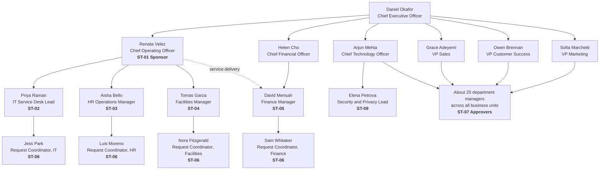

# Breezio: Organization Chart

**Version:** 1.0
**Date:** 2026-09-22
**Author:** Magaly Gonzalez
**Phase:** Slice 1, Phase 1 (Discovery)
**Related documents:** `stakeholders.md`, `discovery.md`

---

## 1. Purpose

This chart puts names and reporting lines behind the stakeholder IDs in
`stakeholders.md`. It shows who sponsors the project, who owns each service team,
who approves requests, and who can stop the AI component.

Breezio and every person on this page are fictional. Names are invented for the
case study. Any resemblance to real people is coincidental.

---

## 2. Organization chart

Solid lines are reporting lines. The dotted line is a service-delivery line:
Finance Operations reports to the CFO, but its request handling is part of the
COO's service scope.

ST-08 (Employees) is everyone at Breezio, so it is not drawn as a box.

---

## 3. Who's who

| ID | Name | Title | Reports to | Role in this project |
|---|---|---|---|---|
| ST-01 | Renata Velez | Chief Operating Officer | CEO | Sponsor. Accountable for every phase. Makes scope decisions and closes open questions |
| ST-02 | Priya Raman | IT Service Desk Lead | COO | Design partner. Owns 45% of request volume |
| ST-03 | Aisha Bello | HR Operations Manager | COO | Owns HR categories and sensitive-data handling |
| ST-04 | Tomas Garza | Facilities Manager | COO | Owns Facilities categories and location fields |
| ST-05 | David Mensah | Finance Manager | CFO, dotted line to COO | Owns approval thresholds and audit needs |
| ST-06 | Jess Park, Luis Moreno, Nora Fitzgerald, Sam Whitaker | Request Coordinators | Their team lead | Daily users. Run the human triage queue. Hand-label the accuracy set in Slice 2 |
| ST-07 | About 25 managers | Department managers | Their VP or C-level | Approve access, purchases, leave, and moves |
| ST-08 | All 300 employees | Requesters | Various | Submit requests and check status |
| ST-09 | Elena Petrova | Security and Privacy Lead | CTO | Review gate before real data or an external AI API is used |

Not stakeholders in this project, shown for context: Daniel Okafor (CEO), Helen
Cho (CFO), Arjun Mehta (CTO), Grace Adeyemi (VP Sales), Owen Brennan (VP Customer
Success), Sofia Marchetti (VP Marketing).

---

## 4. Headcount

| Group | Headcount | Notes |
|---|---|---|
| Executive team | 7 | CEO, COO, CFO, CTO, and three VPs |
| IT | 12 | Includes 1 request coordinator |
| HR | 7 | Includes 1 request coordinator |
| Facilities | 5 | Includes 1 request coordinator |
| Finance | 9 | Includes 1 request coordinator |
| Security and Privacy | 3 | Reports to the CTO |
| Engineering and Product | 99 | Largest requester group |
| Sales | 75 | |
| Customer Success | 55 | |
| Marketing | 28 | |
| **Total** | **300** | |

The four service teams in scope total 33 people, about 11% of the company. They
handle roughly 600 requests a month for the other 267.

---

## 5. Why the reporting lines matter

- **The sponsor owns three of the four service teams directly.** The COO can make
  IT, HR, and Facilities adopt one taxonomy and one intake process.
- **Finance does not report to the sponsor.** The Finance Manager answers to the
  CFO, which is why ST-05 has high influence and why approval thresholds need
  written sign-off (SR-07) rather than a sponsor decision alone.
- **Security reports to the CTO, not the COO.** The sponsor cannot overrule a
  privacy objection. That independence is why ST-09 is a review gate (SR-03).
- **Approvers sit in every business unit.** No single leader can make managers
  respond to approval requests, which is why approval speed (K6) is tracked per
  approver.
