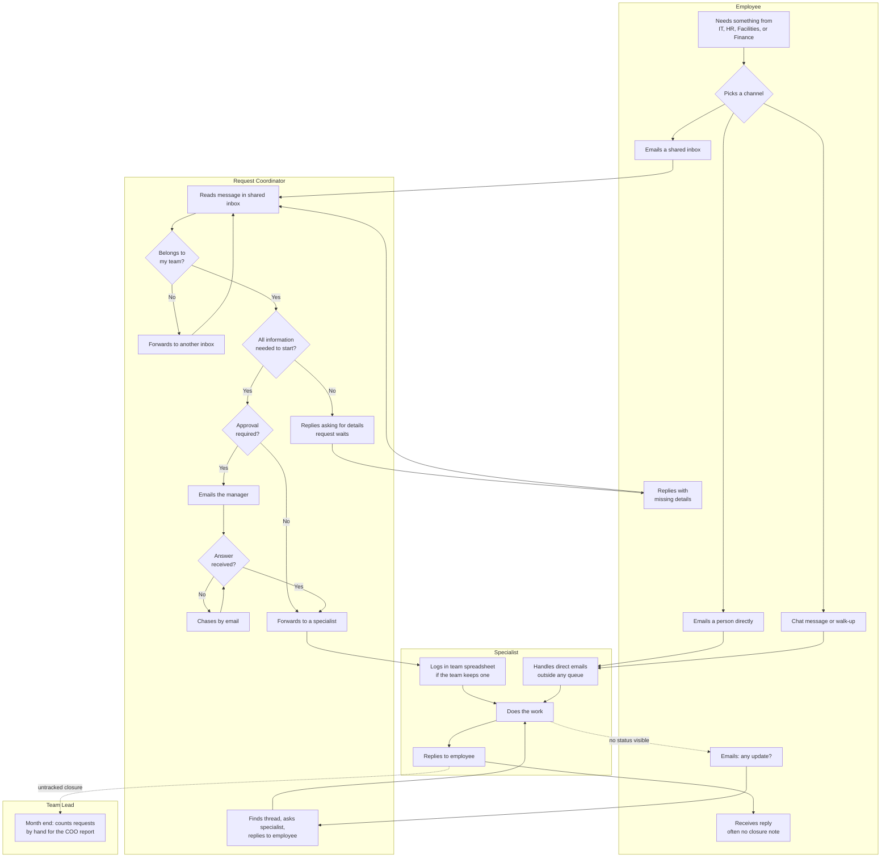

# Breezio Service Hub: Current-State Process

**Version:** 1.0 (current state only)
**Date:** 2026-09-22
**Author:** Magaly Gonzalez
**Phase:** Slice 1, Phase 1 (Discovery)
**Related documents:** `discovery.md`, `stakeholders.md`

The future-state process (§3) and gap analysis (§4) are added in Phase 2.

---

## 1. Scope of the process under review

The process examined here is **the employee service request lifecycle**: from the
moment an employee needs something from IT, HR, Facilities, or Finance, to the
moment the request is resolved and the requester knows it.

The work itself (fixing a laptop, processing a reimbursement) is out of scope.
The focus is everything around the work: intake, routing, information gathering,
approval, status, and reporting.

**Process owner:** Chief Operating Officer (ST-01)
**Volume:** roughly 600 requests per month across four teams
**Actors:** Employee, Request Coordinator, Specialist, Team Lead. Approving managers appear as a step in the Coordinator lane, because today they are reached only by email.

---

## 2. Current state

### 2.1 Narrative

An employee who needs something picks a channel. Most send an email to the
shared inbox they think is right: it-help@, hr@, facilities@, or finance@. Many
skip the inbox and email someone they know personally. Some send a chat message.
Some walk up to a desk.

A Request Coordinator monitors each shared inbox. They read each message, decide
whether it belongs to their team, and forward it if it does not. A request can be
forwarded more than once before it lands with the right team.

About a third of requests arrive without what the team needs to start: an asset
tag, a cost center, a location, a date range. The coordinator replies asking for
it, and the request waits.

If the request needs approval, the coordinator or specialist emails the
employee's manager, then chases when no answer comes. The approval lives in an
email thread. Nobody else can see it.

Once a specialist is assigned, some teams log the request in a spreadsheet, each
with its own columns. Others do not log it at all. There is no request ID, so
when an employee resends the same request, it becomes a second request.

With no visibility into status, employees email "any update?" and the
coordinator has to find the thread, ask the specialist, and reply.

At month end, each team lead counts requests by hand from inboxes and
spreadsheets to produce a report for the COO. The numbers are not comparable
across teams, and they arrive a month late.

### 2.2 Current-state process map

### 2.3 Pain point analysis

| ID | Pain point | Where it occurs | Consequence | Measured by |
|---|---|---|---|---|
| PP-01 | Five intake channels and no single front door | Channel choice | Requests are scattered and some are never seen by a coordinator | K1, K8 |
| PP-02 | The requester has to guess which team owns the request | Channel choice, forwarding | Misrouted requests are forwarded, sometimes more than once | K4 |
| PP-03 | Requests arrive without the information needed to start | Information check | A back-and-forth before any work begins | K5 |
| PP-04 | No request ID | Throughout | Requests cannot be referenced, and resends create duplicates | K8 |
| PP-05 | Approvals happen in email threads and are chased by hand | Approval | Delays, no audit trail, and approvals lost when someone is out | K6 |
| PP-06 | No status visibility for the requester | After assignment | "Any update?" emails that cost the requester and the coordinator time | K7 |
| PP-07 | Each team tracks differently, or not at all | Logging | No shared definition of open, resolved, or late | K2, K8 |
| PP-08 | No service levels | Throughout | Urgency is signaled by subject lines in capitals, not by rules | K3 |
| PP-09 | Direct emails to individuals bypass every queue | Direct channel | Workload is invisible and concentrates on well-known people | K8, K11 |
| PP-10 | Month-end reporting is a manual count | Reporting | Leaders see volume and delays a month late, in numbers that do not compare across teams | K11 |
| PP-11 | Sensitive HR requests sit in a shared inbox all coordinators can read | HR inbox | Personal information is exposed more widely than needed | Q1, Q6 in `discovery.md` |

### 2.4 Quantifying the current state

These figures are modeled for the fictional Breezio. They are assumptions used to
size the opportunity, not measured results.

#### Assumptions

| ID | Assumption | Value |
|---|---|---|
| MA-01 | Requests per month | 600 |
| MA-02 | Initial read, triage decision, and forward, per request | 6 minutes |
| MA-03 | Misroute rate, and rework per misroute | 18%, 10 minutes |
| MA-04 | Missing-information rate, and follow-up per case | 30%, 15 minutes |
| MA-05 | Approval-required rate, and chasing per approval | 20%, 12 minutes |
| MA-06 | Status inquiries per request, and handling per inquiry | 0.6, 5 minutes |
| MA-07 | Manual logging per request | 3 minutes |
| MA-08 | Month-end reporting, per team | 6 hours, 4 teams |
| MA-09 | Loaded labor cost | $45 per hour |

#### Modeled effort

| Activity | Calculation | Hours per month | Hours per year |
|---|---|---|---|
| Initial triage and forwarding | 600 x 6 min | 60 | 720 |
| Misroute rework | 600 x 18% x 10 min | 18 | 216 |
| Missing-information follow-up | 600 x 30% x 15 min | 45 | 540 |
| Approval chasing | 600 x 20% x 12 min | 24 | 288 |
| Status inquiry handling | 600 x 0.6 x 5 min | 30 | 360 |
| Manual logging | 600 x 3 min | 30 | 360 |
| Month-end reporting | 4 teams x 6 hrs | 24 | 288 |
| **Total** | | **231** | **2,772** |

At $45 per hour, the current process consumes roughly **$124,740 per year** of
coordinator and team lead time. That is about 1.3 full-time roles spent on moving
requests around rather than resolving them.

#### Not included in the model

- Employee time spent resending, chasing, and waiting. Real, but not priced here.
- The cost of delay itself: a new hire without a laptop, a vendor paid late.
- Duplicate requests created by resends (PP-04). The rate is unknown without IDs.
- Direct emails that bypass the inboxes (PP-09). Invisible by definition.

The model is deliberately conservative. The excluded costs are likely larger than
the included ones, but they cannot be defended without real data.

---

## 3. Future state

_Added in Slice 1, Phase 2._

## 4. Gap analysis

_Added in Slice 1, Phase 2._
