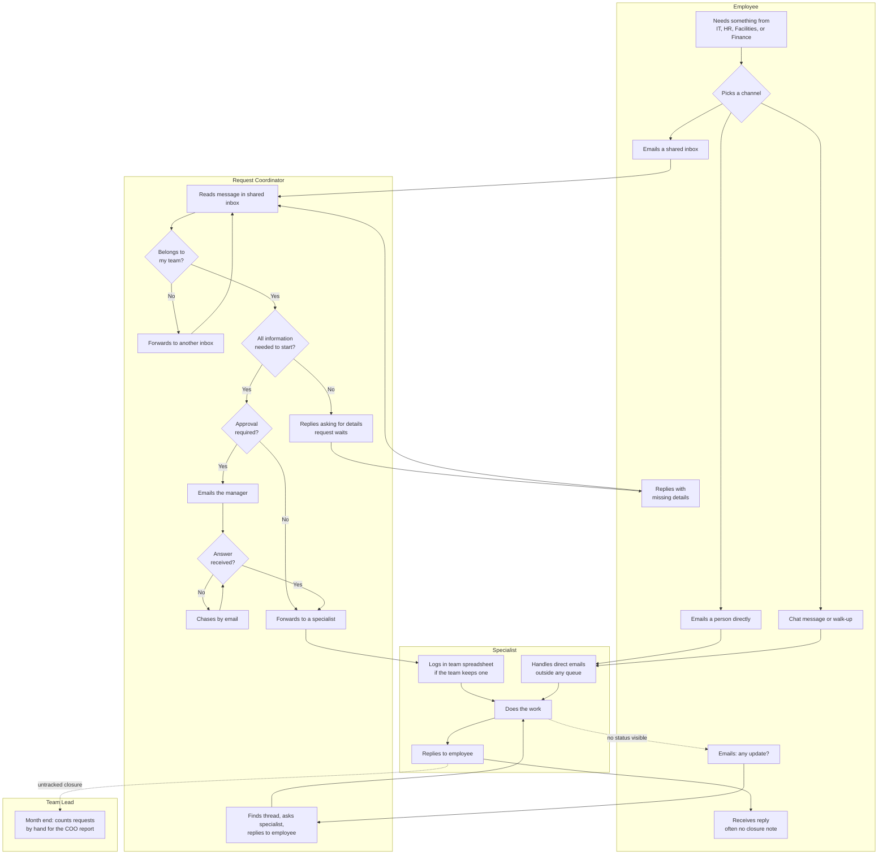
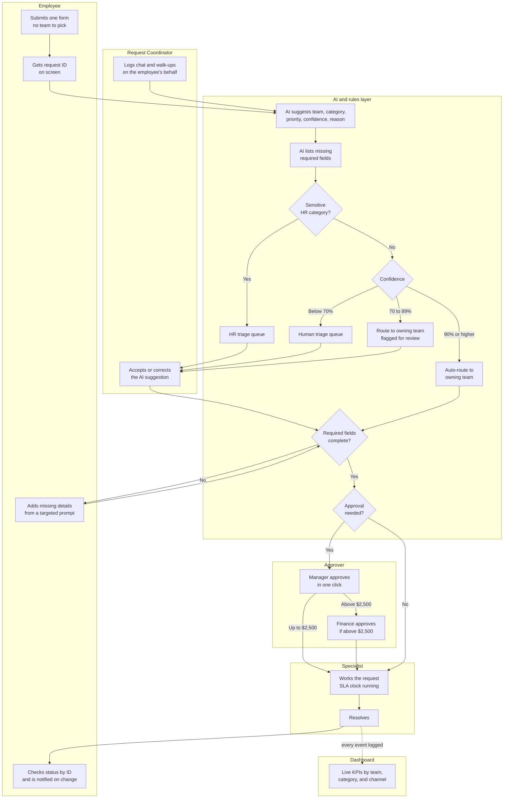

# Breezio Service Hub: Current and Future State Process

**Version:** 1.1
**Date:** 2026-09-22
**Author:** Magaly Gonzalez
**Phase:** Slice 1, Phases 1 and 2
**Related documents:** `discovery.md`, `stakeholders.md`, `requirements.md`

Current state (§2) was mapped in Phase 1. Future state (§3) and gap analysis (§4) were added in Phase 2.

---

## 1. Scope of the process under review

The process examined here is **the employee service request lifecycle**: from the
moment an employee needs something from IT, HR, Facilities, or Finance, to the
moment the request is resolved and the requester knows it.

The work itself (fixing a laptop, processing a reimbursement) is out of scope.
The focus is everything around the work: intake, routing, information gathering,
approval, status, and reporting.

**Process owner:** Chief Operating Officer (ST-01)
**Volume:** roughly 600 requests per month across four teams
**Actors:** Employee, Request Coordinator, Specialist, Team Lead. Approving managers appear as a step in the Coordinator lane, because today they are reached only by email.

---

## 2. Current state

### 2.1 Narrative

An employee who needs something picks a channel. Most send an email to the
shared inbox they think is right: it-help@, hr@, facilities@, or finance@. Many
skip the inbox and email someone they know personally. Some send a chat message.
Some walk up to a desk.

A Request Coordinator monitors each shared inbox. They read each message, decide
whether it belongs to their team, and forward it if it does not. A request can be
forwarded more than once before it lands with the right team.

About a third of requests arrive without what the team needs to start: an asset
tag, a cost center, a location, a date range. The coordinator replies asking for
it, and the request waits.

If the request needs approval, the coordinator or specialist emails the
employee's manager, then chases when no answer comes. The approval lives in an
email thread. Nobody else can see it.

Once a specialist is assigned, some teams log the request in a spreadsheet, each
with its own columns. Others do not log it at all. There is no request ID, so
when an employee resends the same request, it becomes a second request.

With no visibility into status, employees email "any update?" and the
coordinator has to find the thread, ask the specialist, and reply.

At month end, each team lead counts requests by hand from inboxes and
spreadsheets to produce a report for the COO. The numbers are not comparable
across teams, and they arrive a month late.

### 2.2 Current-state process map

### 2.3 Pain point analysis

| ID | Pain point | Where it occurs | Consequence | Measured by |
|---|---|---|---|---|
| PP-01 | Five intake channels and no single front door | Channel choice | Requests are scattered and some are never seen by a coordinator | K1, K8 |
| PP-02 | The requester has to guess which team owns the request | Channel choice, forwarding | Misrouted requests are forwarded, sometimes more than once | K4 |
| PP-03 | Requests arrive without the information needed to start | Information check | A back-and-forth before any work begins | K5 |
| PP-04 | No request ID | Throughout | Requests cannot be referenced, and resends create duplicates | K8 |
| PP-05 | Approvals happen in email threads and are chased by hand | Approval | Delays, no audit trail, and approvals lost when someone is out | K6 |
| PP-06 | No status visibility for the requester | After assignment | "Any update?" emails that cost the requester and the coordinator time | K7 |
| PP-07 | Each team tracks differently, or not at all | Logging | No shared definition of open, resolved, or late | K2, K8 |
| PP-08 | No service levels | Throughout | Urgency is signaled by subject lines in capitals, not by rules | K3 |
| PP-09 | Direct emails to individuals bypass every queue | Direct channel | Workload is invisible and concentrates on well-known people | K8, K11 |
| PP-10 | Month-end reporting is a manual count | Reporting | Leaders see volume and delays a month late, in numbers that do not compare across teams | K11 |
| PP-11 | Sensitive HR requests sit in a shared inbox all coordinators can read | HR inbox | Personal information is exposed more widely than needed | Q1, Q6 in `discovery.md` |

### 2.4 Quantifying the current state

These figures are modeled for the fictional Breezio. They are assumptions used to
size the opportunity, not measured results.

#### Assumptions

| ID | Assumption | Value |
|---|---|---|
| MA-01 | Requests per month | 600 |
| MA-02 | Initial read, triage decision, and forward, per request | 6 minutes |
| MA-03 | Misroute rate, and rework per misroute | 18%, 10 minutes |
| MA-04 | Missing-information rate, and follow-up per case | 30%, 15 minutes |
| MA-05 | Approval-required rate, and chasing per approval | 20%, 12 minutes |
| MA-06 | Status inquiries per request, and handling per inquiry | 0.6, 5 minutes |
| MA-07 | Manual logging per request | 3 minutes |
| MA-08 | Month-end reporting, per team | 6 hours, 4 teams |
| MA-09 | Loaded labor cost | $45 per hour |

#### Modeled effort

| Activity | Calculation | Hours per month | Hours per year |
|---|---|---|---|
| Initial triage and forwarding | 600 x 6 min | 60 | 720 |
| Misroute rework | 600 x 18% x 10 min | 18 | 216 |
| Missing-information follow-up | 600 x 30% x 15 min | 45 | 540 |
| Approval chasing | 600 x 20% x 12 min | 24 | 288 |
| Status inquiry handling | 600 x 0.6 x 5 min | 30 | 360 |
| Manual logging | 600 x 3 min | 30 | 360 |
| Month-end reporting | 4 teams x 6 hrs | 24 | 288 |
| **Total** | | **231** | **2,772** |

At $45 per hour, the current process consumes roughly **$124,740 per year** of
coordinator and team lead time. That is about 1.3 full-time roles spent on moving
requests around rather than resolving them.

#### Not included in the model

- Employee time spent resending, chasing, and waiting. Real, but not priced here.
- The cost of delay itself: a new hire without a laptop, a vendor paid late.
- Duplicate requests created by resends (PP-04). The rate is unknown without IDs.
- Direct emails that bypass the inboxes (PP-09). Invisible by definition.

The model is deliberately conservative. The excluded costs are likely larger than
the included ones, but they cannot be defended without real data.

---

## 3. Future state

### 3.1 Narrative

An employee opens one form and describes what they need. They do not pick a
team. They get a request ID on screen straight away. Chat messages and walk-ups
are logged by a coordinator through the same form, on the employee's behalf.

The AI reads the description and suggests a team, a category, a priority, and a
confidence score, with a one-sentence reason. It also lists any required fields
the description is missing.

The rules layer then decides where the request goes:

- Sensitive HR categories always go to the HR triage queue.
- Confident predictions (90% or higher) go straight to the owning team.
- Likely predictions (70 to 89%) go to the owning team, flagged for a coordinator
  to check.
- Uncertain predictions (below 70%) go to the human triage queue.

If information is missing, the requester is asked for exactly those fields and
the SLA clock pauses. If approval is needed, the manager gets a one-click
request, and Finance is added above $2,500. Every step is logged with a
timestamp. Status is visible by request ID, and the dashboard replaces the
month-end count.

### 3.2 Future-state process map

### 3.3 What changes, step by step

| Current state step | Future state | Why it improves | Delivered by |
|---|---|---|---|
| Employee picks one of five channels | One form, with walk-ups and chat logged through it | One front door, nothing untracked | FR-03, FR-04 |
| No request ID | ID on submission | Requests can be referenced, resends stop creating duplicates | FR-01 |
| Coordinator reads and forwards every message | AI suggests and the rules route | Coordinators only read uncertain or sensitive requests | FR-10, FR-20 |
| Misroutes forwarded by email | One-step correction with a logged reroute | Misroutes are fixed once and measured | FR-21, FR-24 |
| Missing information found by the team, then chased | Missing fields detected at intake and asked for exactly | Work starts with what it needs | FR-12, FR-22 |
| Approval by email and chasing | One-click approval, reminder after 1 day, Finance above $2,500 | Approvals are tracked, fast, and auditable | FR-30 to FR-34 |
| "Any update?" emails | Status by ID and notifications | Nobody has to ask | FR-41, FR-42 |
| Per-team spreadsheets | One lifecycle and one event log | Shared definitions of open, late, and resolved | FR-40, NFR-04 |
| Month-end count by hand | Live dashboard | Leaders see the month as it happens | FR-50 to FR-57 |
| Sensitive HR email in a shared inbox | HR-only triage queue | Personal information reaches fewer people | BR-04, NFR-09 |

### 3.4 Modeled future-state effort

These figures model what the process costs **if the KPI targets in
`discovery.md` §5 are met**. They are targets, not a forecast. The build has to
prove them.

#### Additional assumptions

| ID | Assumption | Value |
|---|---|---|
| MF-01 | Share of requests in sensitive categories (always human triage) | 22% |
| MF-02 | Coordinator time per request: auto-routed spot check, flagged review, full human triage | 0.5, 2, and 6 minutes |
| MF-03 | Confidence band mix for non-sensitive requests, base scenario | 60% auto-route, 25% flagged, 15% human triage |
| MF-04 | Misroute, missing-information, and status inquiry rates | At target: 5%, 10%, 0.15 per request |
| MF-05 | Approval handling after reminders are automated | 2 minutes per approval |
| MF-06 | Requests logged on behalf (chat and walk-ups) | 10%, at 3 minutes each |
| MF-07 | Dashboard review replacing month-end reporting | 1 hour per team per month |

MF-03 is an assumption, not a measurement. The real band mix is only known after
the Slice 2 labeled evaluation (K9, K10).

#### Base scenario

| Activity | Current hrs per month | Future hrs per month | Saved per year |
|---|---|---|---|
| Triage and forwarding | 60 | 26.5 | 402 |
| Misroute rework | 18 | 5.0 | 156 |
| Missing-information follow-up | 45 | 15.0 | 360 |
| Approval chasing | 24 | 4.0 | 240 |
| Status inquiry handling | 30 | 7.5 | 270 |
| Logging | 30 | 3.0 | 324 |
| Reporting | 24 | 4.0 | 240 |
| **Total** | **231** | **65.0** | **1,992** |

**Modeled annual saving in the base scenario: 1,992 hours, about $89,640 at $45
per hour.** That is roughly 1.3 full-time roles of triage work reduced to about
0.4.

#### Sensitivity to the AI band mix

| Scenario | Auto / flagged / human triage | Future hrs per year | Saved per year | Saved at $45 |
|---|---|---|---|---|
| Conservative | 40% / 30% / 30% | 864 | 1,908 | $85,860 |
| Base | 60% / 25% / 15% | 780 | 1,992 | $89,640 |
| Optimistic | 75% / 15% / 10% | 740 | 2,032 | $91,440 |

**What this shows:** the saving barely moves with the AI band mix. Most of it
comes from structure: one front door, required fields at intake, tracked
approvals, and visible status. The AI shortens triage, but hitting the K4, K5,
and K7 targets matters more than a high auto-route rate. That is a useful
finding for the sponsor. It also means the project still pays off if the model
turns out less confident than hoped.

#### Not included

- AI running cost per request. Tracked from Phase 4 (NFR-07).
- Build and change-management effort.
- Employee time saved, which remains unpriced, as in §2.4.

---

## 4. Gap analysis

| Gap | Current capability | Required capability | Requirement |
|---|---|---|---|
| No single intake | Five channels, two untracked | One form, with on-behalf logging | FR-03, FR-04 |
| No request identity | None | Unique ID on creation | FR-01 |
| No routing logic | Human judgment per email | AI suggestion plus a rules layer with thresholds | FR-10, FR-20, BR-01 to BR-04 |
| No intake validation | Found by the team, later | Required fields per category, detected at intake | FR-12, FR-22 |
| No approval workflow | Email threads | Sequenced approvals with audit trail and reminders | FR-30 to FR-34 |
| No service levels | None | SLA per category, with pause rules | FR-23, BR-06, BR-07 |
| No shared status model | Per-team spreadsheets | One lifecycle, one event log | FR-40, NFR-04 |
| No requester visibility | Ask by email | Lookup by ID, and notifications | FR-41, FR-42 |
| No live reporting | Manual month-end count | Dashboard over SQL views | FR-50 to FR-57, NFR-03 |
| No sensitive-data control | Shared inbox | HR-only queue and access | BR-04, NFR-09 |
| No evidence for AI accuracy | Not applicable | Labeled holdout evaluation before auto-routing | FR-70 to FR-72 |
